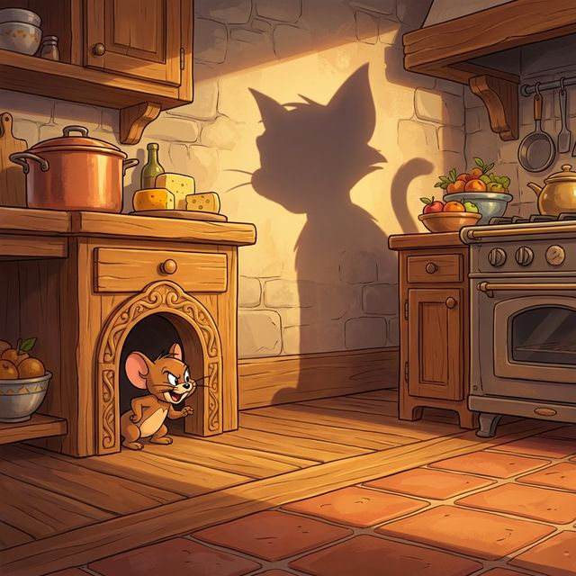

<div align="center">
  
  <h1>🚀 Mouse Chase - Steering Behaviors</h1>
  <p>A fun, interactive "Tom & Jerry" inspired web game demonstrating AI steering behaviors and vector physics!</p>

  <!-- Badges -->
  
  
  
  
</div>

---

## 📖 Table of Contents
- [About](#-about)
- [Features](#-features)
- [Tech Stack](#️-tech-stack)
- [Installation](#-installation)
- [Usage](#-usage)
- [Project Structure](#-project-structure)
- [Contributing](#-contributing)
- [License](#-license)
- [Author](#-author)

---

## 🎯 About
**Mouse Chase** is an interactive simulation and game built to demonstrate **Craig Reynolds' Steering Behaviors**. You control a fast, agile Mouse (Jerry) attempting to navigate various environments to collect Cheese while avoiding relentless Predator Cats (Tom) and hidden Traps. 

The project heavily focuses on AI movement patterns including `Seek`, `Flee`, `Wander`, and `Pursue`, rendering everything dynamically via a vector-based physics engine.

---

## ✨ Features
- 🐭 **Dynamic Mouse Control** — Switch between manual player control or autonomous steering (AI seek).
- 🐱 **Predator AI** — Cats use tracking algorithms to hunt you down, while others wander the map randomly.
- 🧀 **Level Progression** — Survive and collect cheese to advance through 8 distinct levels, each with increasing difficulty and unique floor patterns.
- 🕳️ **Teleportation Holes** — Jump into mouse holes positioned around the map to instantly teleport and escape danger.
- 🪤 **Dangerous Traps** — Avoid stationary and moving traps that instantly cost you a life upon collision.
- 🎩 **Fake Mice Decoys** — Spawn decoys that use wander behaviors to distract the hunting cats.
- 🛠️ **Developer Debug Mode** — Toggle visual debug tools to see perception radii, velocity vectors, and steering forces in real-time.

---

## 🛠️ Tech Stack
| Technology | Purpose |
|------------|---------|
| **JavaScript (ES6)** | Core Game Logic & Object-Oriented Entities |
| **p5.js**      | Canvas Rendering, Vector Math, and Physics |
| **HTML5** | Application Entry Point |
| **CSS3** | Heads-Up Display (HUD) and UI Styling |

---

## 📦 Installation
Running the project locally is extremely simple since it is completely client-side.

1. **Clone the repository:**
   ```bash
   git clone https://github.com/KhairatMouhcine/Tom-Jerry.git
   cd Tom-Jerry
   ```

2. **Run a local server:**
   Due to browser CORS policies regarding local files, you should run a local server.
   *Using Python:*
   ```bash
   python -m http.server 8000
   ```
   *Using Node (Live Server):*
   ```bash
   npx live-server
   ```

3. **Open in browser:**
   Navigate to `http://localhost:8000` (or the port provided by your server).

---

## 🚀 Usage
- **Movement:** Move your mouse cursor across the screen; the main Mouse will use `seek` behavior to follow it.
- **Goals:** Collect the Cheese (`🧀`) to increase your score and level up.
- **Avoid:** Keep your distance from Cats (`🐱`) and Traps (`🪤`). You have 5 lives.
- **Shortcuts & Controls:**
  - `[D]` - Toggle Debug Mode (shows vectors and boundaries).
  - `[R]` - Restart game / Quit Demo mode.
  - `[F]` - Spawn a Fake Mouse decoy to distract cats.

---

## 📁 Project Structure
```text
Tom-Jerry/
├── index.html           # Main entry point containing the canvas container
├── style.css            # Styles for the game UI and HUD
├── sketch.js            # Main game loop, rendering, level management, and collision detection
├── vehicle.js           # Base class containing vector physics (NEVER MODIFY DIRECTLY)
├── Cat.js               # Cat entity class (Predator behaviors)
├── Mouse.js             # Mouse entity class (Player/Seek behaviors)
├── FakeMouse.js         # Decoy entity class (Wander behavior)
├── Target.js            # Cheese/Target logic
├── rules.md             # Developer guidelines for steering behaviors implementation
├── logo_bg.png          # Main menu background/logo asset
└── libraries/           # Local p5.js dependencies
    ├── p5.min.js
    └── p5.sound.min.js
```

---

## 🤝 Contributing
Contributions are highly welcome! To contribute:
1. Fork the project.
2. Read the `rules.md` file for strict development guidelines on how to implement new Steering Behaviors.
3. Create a Feature Branch (`git checkout -b feature/NewBehavior`).
4. Commit your changes (`git commit -m 'feat: Add obstacle avoidance'`).
5. Push to the Branch (`git push origin feature/NewBehavior`).
6. Open a Pull Request.

---

## 📄 License
This project is licensed under the MIT License. See the [LICENSE](LICENSE) file for more details.

---

## 👨‍💻 Author

<div align="center">
  
  <h3>KhairatMouhcine</h3>
  <p>
    <a href="https://github.com/KhairatMouhcine">
      
    </a>
    <a href="mailto:khairatmouhcine125@gmail.com">
      
    </a>
  </p>
</div>
